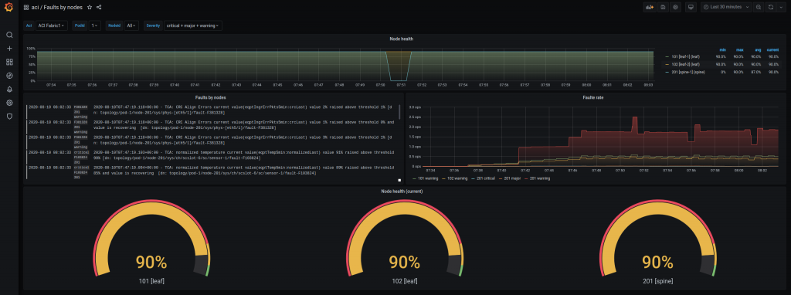

aci-streamer - An Cisco ACI log streamer using ACI REST API subscription mechanism.
--------------------

[](https://developer.cisco.com/codeexchange/github/repo/opsdis/aci-streamer)

> This project is still in alpha and everything may change. If this software is useful or might be, please share
> your experience and/or improvements.  

# Overview
The aci-streamer use the Cisco ACI API subscription to provide log streaming on events on ACI classes. 
The most basic example is subscribing to events on the ACI class `faultInst` to get continues stream of fault events.

The streamed events are by default written to stdout and format is json, so it's easy to consume by any log systems 
like [Loki](https://github.com/grafana/loki) and [Elastic](https://www.elastic.co/).



In the above screenshot we have combined Prometheus and Loki data sources in the same dashboard. 
In the middle row we have the Loki logs based on a “stream” from the aci-streamer called faults. 

In the left graph we have the log panel for Loki logs. The query is based on the upper left Grafana variable filters 
that are applied for the whole dashboard.

    {fabric=~"$Aci",stream="faults",podid=~"$Podid",nodeid=~"$Nodeid",severity=~"$Severity"}

On the right graph we create a simple fault rate metric based on the log data.

    sum by (nodeid,severity) (rate({stream="faults",fabric=~"$Aci",podid=~"$Podid",nodeid=~"$Nodeid",severity=~"$Severity"}[5m]))

The rest of the graphs are based on the aci-exporter Prometheus data using the same label filters, so we can drill down both on pod, node and severity.

The events streams are configured by a definition of `streams`. The below example create a stream of ACI created sessions.

```yaml
streams:
  sessions:
    # The ACI class to subscribe to
    class_name: aaaActiveUserSession
    # The query parameters to use for the subscription
    query_parameter: "?query-target=self&query-target-filter=and(wcard(aaaActiveUserSession.status,\"created\"))"
    # The json root of where data is collected
    root: imdata.0.aaaActiveUserSession.attributes    
    # A json key called mesg that has a format, Go fmt.Sprintf, where source property names is inserted
    # This is typical a field that do not exist in the original json
    message:
      name: mesg
      format: "%s - %s"
      property_names:
        - name
        - ipAddress
```
Original message from ACI looks like:
```json
{
	"subscriptionId": ["72066106679951361"],
	"imdata": [{
		"aaaActiveUserSession": {
			"attributes": {
				"annotation": "",
				"childAction": "",
				"descr": "",
				"dn": "uni/usersessext/actsession-CwqMYooyRDKiftKyopDgGw==",
				"expiryTime": "2020-08-04T14:14:09.692+00:00",
				"extMngdBy": "",
				"hashToken": "CwqMYooyRDKiftKyopDgGw==",
				"ipAddress": "10.10.20.141",
				"lcOwn": "local",
				"loginTime": "2020-08-04T14:04:09.692+00:00",
				"modTs": "2020-08-04T14:04:09.691+00:00",
				"name": "admin",
				"nameAlias": "",
				"ownerKey": "",
				"ownerTag": "",
				"rn": "",
				"status": "created",
				"uType": "local",
				"uid": "0"
			}
		}
	}]
}
```
After processed by the streams configuration:
```json
{
	"annotation": "",
	"childAction": "",
	"descr": "",
	"dn": "uni/usersessext/actsession-CwqMYooyRDKiftKyopDgGw==",
	"expiryTime": "2020-08-04T14:14:09.692+00:00",
	"extMngdBy": "",
	"hashToken": "CwqMYooyRDKiftKyopDgGw==",
	"ipAddress": "10.10.20.141",
	"lcOwn": "local",
	"loginTime": "2020-08-04T14:04:09.692+00:00",
	"modTs": "2020-08-04T14:04:09.691+00:00",
	"name": "admin",
	"nameAlias": "",
	"ownerKey": "",
	"ownerTag": "",
	"rn": "",
	"status": "created",
	"uType": "local",
	"uid": "0",
	"mesg": "admin - 10.10.20.141",
	"fabric": "ACI Fabric1",
	"stream": "sessions"
}
```
The structure has been flattened from the `root` definition. Three additional keys has been added:
- `fabric` the name of the ACI fabric
- `stream` then name of the stream configuration
- `mesg` the created new field

> The main reason for the use of the `mesg` definition is to create a combined log key to use when saved to the log 
> system.

A typical Loki configuration for the above example would be:

```yaml
  pipeline_stages:
  - json:
     expressions:
       # Get the stream name
       stream: stream
  - labels:
      stream:
  - match: 
      # Use selector for each stream
      selector: '{stream="sessions"}'
      stages:
      - json:
         # Define the json keys to use
         expressions:
           message: mesg
           status: status
           fabric: fabric
      - labels:
           # Define which keys to be used as labels 
           status:
           fabric:
      - output:
          # The key to use to write as Loki data
          source: message 
```

With the Loki `selector` different stream's that are logged to the same file descriptor that the 
aci-streamer writes to can be handled in unique ways.

With aci-streamer we can for a stream also use a configuration directive called `labels`. We use the example to stream 
ACI faults.

```yaml
streams:
  faults:
    class_name: faultInst
    root: imdata.0.faultInst.attributes
    query_parameter: ""
    labels:
      - property_name: dn
        regex: "^topology/pod-(?P<podid>[1-9][0-9]*)/node-(?P<nodeid>[1-9][0-9]*)/sys/.*"
    message:
      name: message
      format: "%s - %s [dn: %s]"
      # Names are add to the format in the order they are written
      property_names:
        - descr
        - dn
```
In the above example we define that the property key `dn` should be parsed with a regular named expression. The above
will result in two, if matched, new keys called `podid` and `nodeid` with value.

This will result in the following stream data:

```json
{
	"ack": "no",
	"cause": "threshold-crossed",
	"changeSet": "crcLast:4",
	"childAction": "",
	"code": "F381328",
	"created": "2020-08-03T23:09:28.395+00:00",
	"delegated": "no",
	"descr": "TCA: CRC Align Errors current value(eqptIngrErrPkts5min:crcLast) value 4% raised above threshold 1%",
	"dn": "topology/pod-1/node-102/sys/phys-[eth1/3]/fault-F381328",
	"domain": "infra",
	"highestSeverity": "warning",
	"lastTransition": "2020-08-04T16:14:27.106+00:00",
	"lc": "raised",
	"occur": "951",
	"origSeverity": "warning",
	"prevSeverity": "cleared",
	"rn": "",
	"rule": "tca-eqpt-ingr-err-pkts5min-crc-last",
	"severity": "warning",
	"status": "modified",
	"subject": "counter",
	"type": "operational",
	"podid": "1",
	"nodeid": "102",
	"message": "2020-08-04T16:14:27.106+00:00 - TCA: CRC Align Errors current value(eqptIngrErrPkts5min:crcLast) value 4% raised above threshold 1% [dn: topology/pod-1/node-102/sys/phys-[eth1/3]/fault-F381328]",
	"fabric": "ACI Fabric1",
	"timestamp": "2020-08-04T16:14:27.106000000Z",
	"stream": "faults"
}
```
Even if `podid` or `nodeid` was not part of the original event, except part of the `dn` key, they are now separate keys.

For more information about configuration please see the `example-config.yaml`

# Configuration

> For configuration options please see the `example-config.yml` file.

All attributes in the configuration has default values, except for the fabric and the different streams sections.
A fabric profile include the information specific to an ACI fabrics, like authentication and apic(s) url.

If there is multiple apic urls configured the aci-streamer will use the first apic it can log in to starting with the first
in the list.

All configuration properties can be set by using environment variables. The prefix is `ACI_STREAMER_` and property 
must be in uppercase. So to set the property `port` with an environment variable `ACI_STREAMER_PORT=7121`. 

# Installation

## Build 
    go build -o build/aci-streamer  *.go

## Run
By default, the aci-streamer will look for a configuration file called `config.yaml`. The directory search paths are:

- Current directory
- $HOME/.aci-streamer
- usr/local/etc/aci-streamer
- etc/aci-streamer

```
    ./build/aci-streamer -fabric XYZ
```
Where XYZ is a named entry in the fabrics section of the configuration file.

To run against the Cisco ACI sandbox:
```
    ./build/aci-streamer -config example-config.yaml -fabric cisco_sandbox 
```
> Make sure that the sandbox url and authentication is correct. Check out Cisco sandboxes on 
> https://devnetsandbox.cisco.com/RM/Topology - "ACI Simulator AlwaysOn"

# Output
By default, the output is sent to standard out. The output kan also be directed to a file using the 
`-output` flag. When written to a file aci-streamer use the log4go package to write the output. 
The main reason for this to get file rotation on the output, which is good if aci-streamer is deployed 
with a sidecar in kubernetes, like promtail.

# Internal metrics
Internal metrics are exposed in Prometheus exposition format on the endpoint `/metrics`.
To get the metrics in openmetrics format use header `Accept: application/openmetrics-text`
     
# Loki promtail configuration

Please see the example file loggers/promtail.yaml.

# Elastic filebeat configuration

Please see the example file loggers/filebeat.yaml.

# License
This work is licensed under the GNU GENERAL PUBLIC LICENSE Version 3.
 